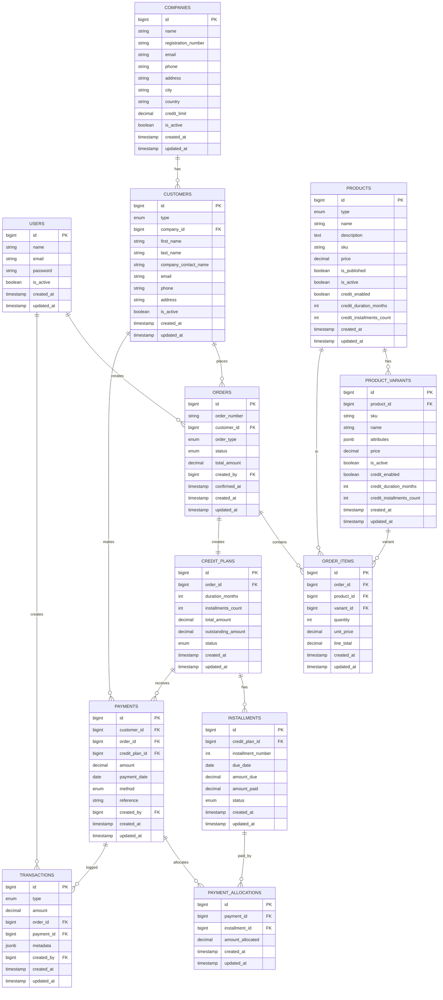

# 🛒 CauriShop (MVP) — Laravel + PostgreSQL

CauriShop est une application web de gestion commerciale permettant de **publier des produits** et de vendre aux clients :
- **clients simples (particuliers)** → achat comptant uniquement
- **clients rattachés à une entreprise** → achat comptant ou **achat à crédit**

Le crédit est configurable au niveau du produit (ou variante) :
- durée du crédit (mois)
- nombre d'échéances
- génération automatique d'un échéancier lors de la validation d'une commande à crédit

---

## 🎯 Objectif MVP

Mettre en production une première version utilisable pour :
1. Gérer les entreprises (clients pro) et les clients simples
2. Publier un catalogue produits (simple + variantes)
3. Prendre des commandes comptant / crédit
4. Générer automatiquement les échéanciers de crédit
5. Suivre les paiements et l'état des soldes

---

## ✅ Fonctionnalités MVP

### 1) Authentification & Sécurité
- Connexion / Déconnexion
- Gestion des rôles & permissions (Admin / Employé) via **Spatie Laravel Permission**
- Journalisation des opérations importantes (transactions)

### 2) Gestion Entreprises
- Création / modification / désactivation entreprise
- Informations : raison sociale, téléphone, email, adresse
- (Optionnel) plafond crédit entreprise

### 3) Gestion Clients
- Clients particuliers
- Clients entreprise (rattachés à une entreprise)
- Un client simple ne peut pas acheter à crédit

### 4) Gestion Produits
- Produit simple : 1 SKU / 1 prix
- Produit à variantes : plusieurs déclinaisons (SKU + prix par variante)
- Publication / dépublication
- Activation crédit :
    - durée en mois
    - nombre d'échéances

### 5) Gestion Commandes
- Création commande
- Ajout de lignes produits / variantes
- Deux types de commande :
    - comptant
    - crédit (uniquement entreprises)
- Validation commande

### 6) Crédit (Échéanciers)
- Génération automatique d'un **Credit Plan**
- Génération automatique des **Installments**
- Statuts des échéances : pending / partial / paid / late

### 7) Paiements
- Enregistrement des paiements
- Paiement partiel autorisé
- Allocation automatique sur la plus ancienne échéance impayée
- Journal des transactions

### 8) Dashboard / Analytics (basique MVP)
- Total ventes (mois en cours)
- Nombre de commandes
- Total crédits en cours
- Nombre d'échéances en retard

---

## 🧰 Stack technique

- **Laravel** 11+
- **PHP** 8.2+
- **PostgreSQL** 14+
- Front : Blade / Livewire / Vue / React (au choix)
- Auth : Laravel Breeze / Jetstream
- Permissions : spatie/laravel-permission

---

## 📦 Installation (local)

### 1) Cloner le projet
```bash
git clone <repo-url>
cd creditshop
```

### 2) Installer les dépendances
```bash
composer install
npm install
```

### 3) Configurer l'environnement
```bash
cp .env.example .env
php artisan key:generate
```

### 4) Configurer PostgreSQL dans .env
```env
APP_NAME=CauriShop
APP_ENV=local
APP_KEY=
APP_DEBUG=true
APP_URL=http://localhost

DB_CONNECTION=pgsql
DB_HOST=127.0.0.1
DB_PORT=5432
DB_DATABASE=creditshop
DB_USERNAME=postgres
DB_PASSWORD=postgres
```

### 5) Migrer la base
```bash
php artisan migrate
```

### 6) Lancer l'application
```bash
php artisan serve
npm run dev
```

---

## 🐳 Installation Docker (optionnel)

### 1) Démarrer les containers
```bash
docker compose up -d --build
```

### 2) Installer dépendances / migrer
```bash
docker exec -it app composer install
docker exec -it app php artisan key:generate
docker exec -it app php artisan migrate
```

---

## 🧪 Tests
```bash
php artisan test
```

---

## 🔑 Seeders (recommandé)

Un seeder permet de créer :
- Admin
- Rôles (Admin / Employé)
- Exemples produits / entreprises

```bash
php artisan db:seed
```

---

## 🧠 Règles métier

### Règle crédit
Crédit autorisé uniquement si :
- client = entreprise (`customers.type = company`)
- produit (ou variante) `credit_enabled = true`

### Création échéancier
À la validation d'une commande à crédit :
- création du `credit_plan`
- génération des `installments`

### Paiement
- un paiement peut être partiel
- allocation automatique sur :
    - échéance la plus ancienne non soldée

---

## 🗄️ Schéma Base de Données (ERD)

Schéma compatible GitHub grâce à Mermaid



---

## 📁 Organisation recommandée du projet

```
app/
  Domain/
    Catalog/
    Orders/
    Credit/
    Payments/
  Http/
    Controllers/
    Requests/
  Services/
  Policies/

database/
  migrations/
  seeders/
```

---

## 📌 Conventions des statuts

### Orders
- `draft` : brouillon
- `confirmed` : validée
- `completed` : entièrement payée / terminée
- `cancelled` : annulée

### Installments
- `pending` : non payée
- `partial` : paiement partiel
- `paid` : soldée
- `late` : échéance dépassée

### Credit plan
- `active` : crédit en cours
- `closed` : crédit entièrement remboursé

---

## 🚀 Roadmap (v2 / v3)

- Paiement en ligne (Mobile Money / Card)
- Gestion de stock avancée
- Factures PDF + TVA
- Relances automatiques (email/whatsapp)
- Pénalités / intérêts de retard
- Portail client (historique commandes + paiement)
- Multi-boutiques / multi-entreprises

---

## 👨‍💻 Auteur

**Mafouz DIALLO**
